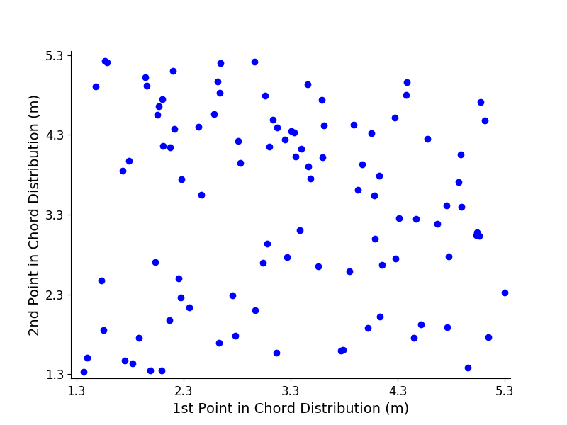

.. SurrModel-Tutorial documentation master file, created by
   sphinx-quickstart on Wed Aug  8 14:43:57 2018.
   You can adapt this file completely to your liking, but it should at least
   contain the root `toctree` directive.

Blade-Damage Tutorial
=====================

This tutorial goes over the basic functionality of the blade-damage repository.
The blade damage repository has three main functions:

* Estimate damage equivalent and extreme moments of a wind turbine using already trained data

* Calculate damage equivalent and extreme moments of wind turbine using FAST

* Calculate blade design training point values for use in a surrogate model

In addition, when this code is used with conjunction with RotorSE, fatigue damage constraints
can be added to the blade optimization routine either directly in the optimization loop,
with an iterative approach, or through use of a surrogate model. These procedures are also described in
this tutorial.

Estimate blade damage of wind turbine design using trained data
~~~~~~~~~~~~~~~~~~~~~~~~~~~~~~~~~~~~~~~~~~~~~~~~~~~~~~~~~~~~~~~

The first use of this code that we cover is to estimate the blade damage of a blade design using
the data that is provided in this repository. The steps to do this are covered in this section. This
procedure depends on the surrogate-modeling-toolbox_. This will need to be downloaded and
installed beforehand.

.. _surrogate-modeling-toolbox: https://smt.readthedocs.io/en/latest/

First, in the script run.py, set::

  FASTinfo['opt_with_surr_model'] = True

And make sure that all the other options in the block are set to False. Next, set::

  description = 'trained_data'

If you desire to use the data set provided in this repository.
Alternatively, you can go into FAST_Files/Opt_Files/ and change the trained_data folder to match
the string set to description. If another data set is being used, make sure the name of the folder
that contains the data matches the description string.

The surrogate model uses a number of design aspects of the blade design to estimate the damage
equivalent and extreme moments experienced by the wind turbine, so we need to set those values.
In the setupFAST function in FAST_util.py, set::

  FASTinfo['FAST_template_name'] = 'testWT'

Next, in the initialize_dv function, set the control point values of the chord and twist
distributions. The control points are equally spaced from the root of the blade
to the tip, and define Akima_ splines which are used to determine the chord and twist
values at any point along the length of the blade. Additional information about Akima splines
can be found here. In the get_bladelength function (also in FAST_util.py), set the blade length.
In the choose_wnd_dir function, set the turbulence intensity and turbine class.

.. _Akima: https://github.com/andrewning/akima

Check that all of the options in setupFAST_checks (function in FAST_util.py)
are set to False. In addition, in the function setupFAST_other, set::

  FASTinfo['calc_DEM_using_sm_no_opt'] = True

And all other options set as false. Set the wind turbine torque
at rated speed. This is done by changing the value of rated_tq.txt, which is located
in the folder that includes the trained data set.

In create_surr_model_params, set what type of approximation model you would like
to use. For example, if you want to use radial basis functions, set::

   FASTinfo['approximation_model'] = 'RBF'

In addition, if you desire to use a Kriging function, set the initial hyper-parameter
values::

  FASTinfo['theta0_val'] = [1e-2]

With these options set, we can now estimate the damage equivalent and extreme moments
of the blade design using a surrogate model. To do so, in the blade-damage folder,
run::

  python run.py

The damage equivalent and extreme moments will print.

Calculate damage equivalent and extreme moments of wind turbine using FAST
~~~~~~~~~~~~~~~~~~~~~~~~~~~~~~~~~~~~~~~~~~~~~~~~~~~~~~~~~~~~~~~~~~~~~~~~~~

The next use of this code is to calculate the DEMs and extreme moments of a
wind turbine using FAST. This functionality depends on FAST.
It may be helpful to go over our previous tutorial, which covers
how to build a FAST executable, a description of FAST input files, and a cursory
explanation of FAST outputs. It also depends on AeroelasticSE_, a python wrapper
for FAST. This will also need to be installed.

Within the blade-damage directory, find damage_components.py. At the top of the script
will be the lines::

  # AeroelasticSE
  sys.path.insert(0, '../RotorSE_FAST/AeroelasticSE/src/AeroelasticSE/FAST_mdao')

  # rainflow
  sys.path.insert(0, '../RotorSE_FAST/AeroelasticSE/src/AeroelasticSE/rainflow')

These are the relative paths for subfolders in the AeroelasticSE repository. Set
these paths so that they congruent with the placement of your local blade-damage
and AeroelasticSE repositories.

Within the blade-damage directory, locate the script run.py. In run.py, specify::

  FASTinfo['calc_fixed_DEMs'] = True

Make sure that all the other options in that block are set to False.
In addition, set the
description variable to some appropriate string.

There are a few things that need to be specified in FAST_util.py. First,
make sure that all the checks in setupFAST_checks are set to False.
Next, specify the locations of the virtual strain gages used in the FAST routine.
You can do this by setting::

  FASTinfo['sgp'] = [1, 2, 3]

This means that for each wind input file, FAST will run three times. Additionally,
we can also set it to be::

  FASTinfo['sgp'] = [4]

Where FAST will only run once for each wind input file.
In the specify_DLCs function, make sure that::

  DLC_List = ['DLC_1_2', 'DLC_1_3', 'DLC_1_4','DLC_1_5', 'DLC_6_1', 'DLC_6_3']
  FASTinfo['rand_seeds'] = np.linspace(1, 6, 6)
  FASTinfo['mws'] = np.linspace(5, 23, 10)

when calculating the damage equivalent moments.
However, for test purposes, you will want to use a small subset
of design load cases to make sure that it is working properly without taking too long.
An example of a test set is::

  DLC_List = ['DLC_1_2', 'DLC_1_3', 'DLC_6_1', 'DLC_6_3']
  FASTinfo['rand_seeds'] = np.linspace(1, 1, 1)
  FASTinfo['mws'] = np.linspace(11, 11, 1)

The wind files for the DLC 1.2, 1.3, 1.4, 1.5, 6.1, and 6.3 are included in this repository.
The nonturbulent wind files (DLC 1.4, 1.5, 6.1, and 6.3) are found in WND_Files/nonturb_wnd_dir,
and were generated using IECWind_, an NREL tool. The turbulent wind files (DLC 1.2, 1.3)
are found in WND_Files/turb_wnd_dir_A_I and WND_Files/turb_wnd_dir_B_I.
These files were generated using the script create_turb_wnd_files.py
(which is included in this repository), which is python wrapper for TurbSim_, another NREL tool.

.. _IECWind: https://nwtc.nrel.gov/IECWind
.. _TurbSim: https://nwtc.nrel.gov/TurbSim

If the user desires to use other wind input files, they are encouraged to familiarize
themselves with TurbSim_ and IECWind_, and to use our TurbSim python wrapper if a large number
of new wind input files are created.

Within this repository, five sets of FAST input files are included. They
can be found in FAST_Files/FAST_File_templates. In general, the easiest way to use
this code is to also use one of these templates. For example, if we want to use
the NREL 5MW templates files, in the setupFAST function in FAST_util.py set::

  FASTinfo['FAST_template_name'] = 'NREL5MW'

The baseline design of the these wind turbines are changed in two ways.
First, the chord and twist distribution, as well as the blade length, are defined in
FAST_util.py, and be changed by following the instructions in the previous section.
Other aspects of the turbine design are changed directly in the FAST input files.
See the FAST user manual for specifics.

If a different set of FAST input files is used, place the files in FAST_Files/FAST_File_templates
folder, and set FASTinfo['FAST_template_name'] to the name of the folder. However,
it is beyond the scope of this tutorial to go over how to create FAST input files for
a wind turbine design.

We are now ready to calculate the damage equivalent moments. In the blade-damage folder,
run::

  python run.py

The damage equivalent moment values will be recorded and stored in FAST_Files/Opt_Files/(description string).

Calculate blade design training point values for use in a surrogate model
~~~~~~~~~~~~~~~~~~~~~~~~~~~~~~~~~~~~~~~~~~~~~~~~~~~~~~~~~~~~~~~~~~~~~~~~~

Before we can train points to use in the surrogate model, we need to calculate
the wind turbine torque at rated wind speed.

Within the blade-damage directory, locate the script run.py. In run.py, specify::

  FASTinfo['calc_fixed_DEMs'] = True

Make sure that all the other options in that block are set to False.
In addition, set the
description variable to some appropriate string, such as train_data.

Within the blade-damage directory, locate the script FAST_util.py.
There are a few things that need to be specified in FAST_util.py. First,
make sure that all the checks in setupFAST_checks are set to False. In the
setupFAST_other function, set::

  FASTinfo['save_rated_torque'] = True

In the specify_DLCs function, set::

  DLC_List = ['DLC_0_0']

From the command line, navigate to the folder that contains Run.py. Then, run::

  python Run.py

This command should create a file that contains the torque at rated speed.
We can now set up the training point calculations. In run.py, specify::

  FASTinfo['calc_surr_model'] = True

Make sure that all the other options in that block are set to False.
There are a few things that need to be specified in FAST_util.py. First,
make sure that all the checks in setupFAST_checks are set to False.
Next, specify the locations of the virtual strain gages used in the FAST routine.
You can do this by setting::

  FASTinfo['sgp'] = [1, 2, 3]

This means that for each wind input file, FAST will run three times. The training
will take longer, but this way there won't be any interpolated data used to train
the surrogate model and will result in a more accurate surrogate model.

In the specify_DLCs function, make sure that::

  DLC_List = ['DLC_1_2', 'DLC_1_3', 'DLC_1_4','DLC_1_5', 'DLC_6_1', 'DLC_6_3']
  FASTinfo['rand_seeds'] = np.linspace(1, 6, 6)
  FASTinfo['mws'] = np.linspace(5, 23, 10)

when training a full surrogate.
However, for test purposes, you will want to use a small subset
of design load cases to make sure that it is working properly without taking too long.
An example of a test set is::

  DLC_List = ['DLC_1_2', 'DLC_1_3', 'DLC_6_1', 'DLC_6_3']
  FASTinfo['rand_seeds'] = np.linspace(1, 1, 1)
  FASTinfo['mws'] = np.linspace(11, 11, 1)

In the create_surr_model_params function, specify how many points we will attempt
to train in the surrogate model. For example, if we want to train 1000, points::

  FASTinfo['num_pts'] = 1000

Also, make sure that::

  FASTinfo['training_point_dist'] = 'lhs'

An example of 100 points being specified with linear hypercube spacing in two
directions is shown below.

.. note:: Initial work supported a full factorial option (linear) as well as linear hypercube spacing (lhs), but functionality has only been developed for lhs.

In the setupFAST function, specify which reference turbine design template will be
used. For example, if we want to use the WindPACT 5.0 MW reference turbine::

  FASTinfo['FAST_template_name'] = 'WP_5.0MW'

Note that if a WindPACT reference turbine is used, also set::

  FASTinfo['set_chord_twist'] = True

We can now train the surrogate model. An example of doing this would be to
include the following lines in a batch script::

  #SBATCH --array=1-999 # job array size
  echo ${SLURM_ARRAY_TASK_ID}
  python runOPT.py ${SLURM_ARRAY_TASK_ID}

on the supercomputer. The size of
the array will depend on the number of training points. Once all the points
have been trained, use the function combine_results
(in the script FAST_Files/combine_sm_results.py). This is needed if only one wind turbine
is being used to train the surrogate model, or a number of wind turbines. Set
opt_file_srcs as the string descriptions defined in run.py, and opt_file_dest
as the description used in run.py when we next use the surrogate model. Note that
some data may not have been recorded because for some turbine designs, FAST may not
have been able to converge.
This function does have some nice functionality in that it can handle these cases.

Blade design optimization with fatigue damage constraints
=========================================================

We now explain how to optimize a blade design using fatigue damage constraints.
We outline three methods:

* Optimize with FAST calculation in the loop

* Optimize with fixed DEMs

* Optimize blade design with surrogate model for fatigue damage

To begin, clone this branch of AeroelasticSE_. AeroelasticSE is a python wrapper
for FAST. In addition, clone this branch of RotorSE_. RotorSE is an engineering
model for the analysis and optimization of wind turbine rotors.
Both AeroelasticSE and RotorSE are dependent on a number of sub-packages, so
make sure these are installed correctly.
Next, compile
a FAST executable. Instructions on how to do this can be found in our previous
tutorial_.

.. _tutorial: https://fast-tutorial.readthedocs.io/en/latest/
.. _RotorSE: https://github.com/byuflowlab/RotorSE
.. _AeroelasticSE: https://github.com/byuflowlab/AeroelasticSE/tree/rotorse_fast_connection

Optimize with FAST calculation in the loop
~~~~~~~~~~~~~~~~~~~~~~~~~~~~~~~~~~~~~~~~~~

To optimize a blade design while performing the FAST calculation within the optimization
loop, find the RunOPT.py script in the RotorSE repository.
It will be in the src/rotorse folder. Next, set::

  FASTinfo['opt_with_FAST_in_loop'] = True

Once the training data has been created, set::

  FASTinfo['opt_with_surr_model'] = True

and all other options set as false in that block. You can now run the optimization routine
with the command::

  python runOPT.py

Note that unless a small number (1-3) of wind input files are used, this optimization
will take a very long time to complete. Even with a small set of wind input files,
this routine is still very computationally expensive.

Optimize with fixed DEMs
~~~~~~~~~~~~~~~~~~~~~~~~

The next method we describe is to optimize a blade design using fixed damage equivalent moments,
to do this, follow the steps in calculating damage equivalent and extreme moments of wind turbine using FAST.
Once this has been done, locate the file RunOPT.py in the RotorSE repository.
It will be in the src/rotorse folder. Finally, set::

  FASTinfo['opt_with_fixed_DEMs'] = True

and all other options set as false in that block. You can now run the optimization routine
with the command::

  python runOPT.py

If you desire to iteratively improve the blade design and update the damage equivalent
moments used in the optimization, the process is relatively straightforward.
Once the optimization is complete, set the optimized values of the design variables
in the initialize_rotor_dv function in FAST_util.py (in the blade-damage repository),
recalculate the damage equivalent moments, and rerun the optimization with
the updated DEMs.

Optimize blade design with surrogate model for fatigue damage
~~~~~~~~~~~~~~~~~~~~~~~~~~~~~~~~~~~~~~~~~~~~~~~~~~~~~~~~~~~~~

First, in the script run.py, set::

  FASTinfo['opt_with_surr_model'] = True

And make sure that all the other options in the block are set to False. Next, set::

  description = 'trained_data'

If you desire to use the data set provided in this repository.
Alternatively, you can go into FAST_Files/Opt_Files/ and change the trained_data folder to match
the string set to description. If another data set is being used, make sure the name of the folder
that contains the data matches the description string.

In create_surr_model_params, set what type of approximation model you would like
to use. For example, if you want to use radial basis functions, set::

   FASTinfo['approximation_model'] = 'RBF'

In addition, if you desire to use a Kriging function, set the initial hyper-parameter
values::

  FASTinfo['theta0_val'] = [1e-2]

With these options set, when RunOPT.py is run again, it should create the surrogate
model before the optimization begins.

.. toctree::
   :maxdepth: 2
   :caption: Contents:

Indices and tables
==================

* :ref:`genindex`
* :ref:`modindex`
* :ref:`search`
